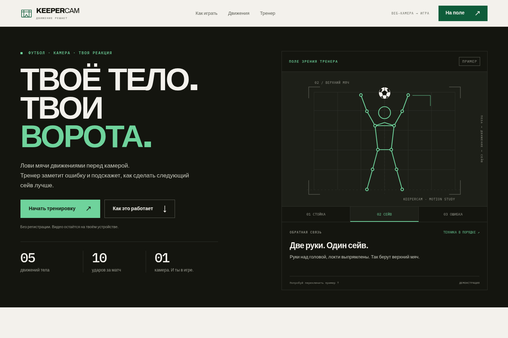

# KeeperCam 🧤 — стань вратарём перед веб-камерой

**KeeperCam** — браузерная игра про вратаря: игрок отбивает мячи движениями тела, а AI-тренер объясняет, как улучшить технику. Собран локально запускаемый MVP: от запуска камеры и обучения до матча из 10 ударов, итогового счёта и таблицы рекордов.



Интерфейс ведёт игрока через подготовку камеры, калибровку, короткое обучение и матч. На главной можно переключить схему «стойка / сейв / ошибка» ещё до включения камеры. Во время игры большая область отведена видео, а текущая подсказка тренера, движение и счёт видны рядом. Экран результатов позволяет разобрать каждый из десяти ударов.

[Mobile preview](docs/design-mobile.png)

## What it is

KeeperCam is a browser goalkeeper game controlled by your body. Pose recognition runs locally in the browser; video frames are not uploaded. Track: Game (with coaching).

## What is implemented

- Camera permission flow with specific recovery messages.
- MediaPipe Pose Landmarker Lite, with GPU to CPU fallback.
- Mirrored camera view and a live 33-landmark skeleton overlay.
- Model and WebAssembly runtime are self-hosted under `public/`.
- Three-second body calibration and One Euro smoothing for landmark movement.
- Five live rule-based movement meters; press `D` to show feature values and FPS.
- A short tutorial that asks the player to trigger the one-hand error coach.
- Ten-shot game loop, target zones, scoring, reaction timing, results and local leaderboard.
- Russian technique hints with highlighted joints, optional speech, and synthesized game sounds.
- Ten-shot match with four target zones, reaction scoring, streaks, per-shot technique notes, and a results timeline.
- Calibration, five-move tutorial, and a deliberate one-hand mistake demonstration.
- Results summary with frequent coaching mistakes and a local top-10 leaderboard.
- Pauses the game when the tab is hidden and reinitializes pose tracking when the player returns.
- Shows a low-performance notice if tracking remains below 12 FPS for 3 seconds.
- Requires WebGL 2 for frame processing; falls back from GPU inference to CPU when WebGL remains available.

## Movements

| Movement | What the detector checks |
|---|---|
| READY / Стойка | Bent knees, stance wider than shoulders, hands between shoulders and hips, centered body |
| DIVE_LEFT / Бросок влево | Body center shifts left and a wrist reaches left beyond the calibrated shoulder width |
| DIVE_RIGHT / Бросок вправо | Body center shifts right and a wrist reaches right beyond the calibrated shoulder width |
| HIGH / Верхний мяч | Both wrists rise above the head and both elbows extend |
| LOW / Нижний мяч | Hips lower relative to calibration and both wrists move below the hips |

Movement thresholds are grouped in `src/config.ts`. Each meter uses a progress score; a move event requires the rule to remain true for 150 ms and releases below 60% progress.

For troubleshooting, append `?delegate=cpu` to the local URL to select the CPU inference delegate directly (WebGL 2 is still required by MediaPipe’s video processing graph).

## Run locally

```sh
npm install
npm run dev
```

Open the localhost URL printed by Vite and allow camera access. Camera APIs require HTTPS or localhost.

## Build

```sh
npm run build
npm run preview
```

The static production output is written to `dist/`. It can be deployed to Vercel or Netlify when a public demo link is needed.

## Recognition pipeline

Camera → MediaPipe Pose Landmarker (33 landmarks, local inference) → One Euro smoothing → mirrored screen coordinates → body calibration → geometric movement rules → live meters and canvas skeleton overlay.

## Error coach

The coach evaluates framing, goalkeeper stance, and save technique rules each frame. It waits 300 ms before showing the highest-priority hint, highlights the relevant joints, and can speak the hint in Russian. The tutorial includes a deliberate one-hand high-save attempt so the player can see the coach catch a mistake.

## Borrowed work

- Vite TypeScript template (project scaffold).
- `@mediapipe/tasks-vision` and the official MediaPipe Pose Landmarker Lite model.
- MediaPipe WASM runtime files distributed with `@mediapipe/tasks-vision`.

Game, recognition-rule, and coaching logic are implemented in this repository.
